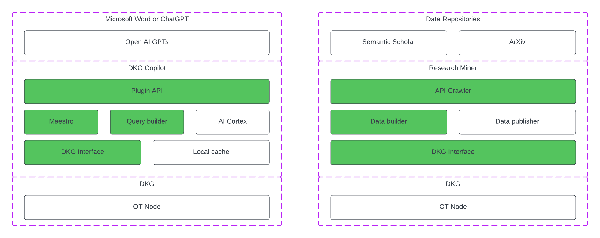

# OriginTrail DKG AI-powered copilot plugin for scientific research

This repository contains source code for AI-powered copilot plugin for scientific research that combines the OriginTrail DKG with LLMs.
The plugin is designed to help retrieve information on scientific papers, analyze their results, and manage citations within the Microsoft Word copilot. 

Such plugin should allow more effective and efficient research by providing access to information that could be verified and analyzed using the OriginTrail decentralized knowledge graph (DKG).
Key benefits of this plugin include ensuring data verifiability and trust by using the DKG, as well as performing machine learning algorithms over trusted data.


## Project specification

This project aims to develop an AI-powered copilot plugin for scientific research. This plugin will improve the capabilities of LLMs by integrating a trust and verification layer through the DKG.

### User stories

The primary actors in this project are the user that uses the plugin via copilot, copilot as an LLVM assistant, plugin as a standalone application deployed on a server, and the DKG.

- As a user, I can ask the plugin to retrieve information about scientific papers from the DKG in the natural language.
- As a user, I can ask the plugin to perform clustering or regression over retrieved data.
- As a user, I can manually verify the integrity proofs and ownership of retrieved information from the DKG using data retrieved from the DKG and blockchain transactions.
- As a user, I can provide feedback on the accuracy or relevance of the retrieved information about scientific papers, so the plugin can improve its recommendations over time.

### Functional requirements

#### Data Collection

- FR1.1: The assets bot must be able to retrieve up to 10k scientific papers related to machine learning from the [Semantic Scholar](https://www.semanticscholar.org/product/api) and [Semopenalex](https://semopenalex.org/resource/semopenalex:UniversalSearch) repositories.
- FR1.2: The assets bot should convert the retrieved scientific papers into knowledge assets, structuring them according to the [ScholarlyArticle](https://schema.org/ScholarlyArticle) and [Semopenalex](https://semopenalex.org/resource/?uri=https%3A%2F%2Fsemopenalex.org%2Fvocab%23) ontologies.
- FR1.3: The assets bot must have the capability to publish the created knowledge assets to the DKG.

#### Knowledge Retrieval and Inference

- FR2.1: The plugin should provide a set of techniques to build a SPARQL query based on natural language question and retrieve information from the DKG.
- FR2.2: The plugin should provide clustering or regression over retrieved data from the DKG.

### Technical requirements

#### Integration

TR1.1: The plugin must integrate seamlessly with an OpenAI LLM copilot (e.g. ChatGPT or Microsoft Word).
TR1.2: The assets bot should have an API integration with the data repositories to retrieve relevant data.
TR1.3: The plugin and assets bot must contain integration with the DKG for publishing and retrieving knowledge assets.

#### Performance and Extensibility

TR2.1: The plugin should ensure efficient data retrieval and processing, especially when dealing with large data.
TR2.2: The plugin's architecture should be modular to allow for feature additions.

### Architecture diagrams

The project consists of the DKG plugin and the assets bot.


In the DKG plugin, the API module presents an interface for interactions with the LLM model. The Query Builder contains functionalities for constructing a SPARQL query. The AI Cortex module is used for inference over retrieved data. The Maestro orchestrator synchronizes all requests and implements the user feedback loop.


In the assets bot, the API crawler retrieves data from repositories. The Data Builder module transforms the retrieved data into assets using the ScholarlyArticle and Semopenalex ontologies. The Data Importer handles data import and interaction with the DKG using batching techniques for efficient data import.

### Sequence diagrams

The provided sequence diagrams illustrate the flow of operations for various functionalities.

#### Ask a question


<details>
title Ask a question

participant Researcher
participant ChatGPT
participant Plugin API
participant Maestro
participant Query Builder
participant OT-Node

Researcher->ChatGPT:How many papers or RFCs are published in 2023 with OriginTrail affiliation?

ChatGPT->Plugin API:POST /ask\n\nbody: {\nquestion: "How many papers or RFCs are published in 2023 with OriginTrail affiliation?",\nsparql_query: "SELECT count (?papers) ...",\nentities: ["origin trail", "papers", "2023"],\nrelations: ["are published"]\n}

Plugin API->Maestro:ask (payload)
Maestro->Query Builder:syntax_validation (sparql_query)
Maestro<--Query Builder:status
Maestro->Query Builder:semantic_validation (sparql_query)
Maestro<--Query Builder:sparql_query
Maestro->OT-Node:dkg.query(sparql_query)
Maestro<--OT-Node:result
Maestro->Query Builder:supervised_sparql_generator (question, ontology)
Maestro<--Query Builder:sparql_query
Maestro->OT-Node:dkg.query(sparql_query)
Maestro<--OT-Node:result
Maestro->Query Builder:supervised_few_shot_sparql_generator (question, ontology)
Maestro<--Query Builder:sparql_query
Maestro->OT-Node:dkg.query(sparql_query)
Maestro<--OT-Node:result
Maestro->Query Builder:encoder_decoder_translator (question, ontology)
Maestro<--Query Builder:sparql_query
Maestro->OT-Node:dkg.query(sparql_query)
Maestro<--OT-Node:result
Maestro->Query Builder:entities_extraction (question, entities)
Maestro<--Query Builder:entities
Maestro->OT-Node:dkg.query(predefined_sparql_query_with_entities)
Maestro<--OT-Node:result
Maestro->Maestro:make_decision (result)
ChatGPT<--Maestro:response
</details>

As a first step, a user asks a question to the copilot: "How many papers or RFCs were published in 2023 with an OriginTrail affiliation?". The LLM creates a POST request with a payload that includes the original question, an initial SPARQL query generated by the LLM, and the extracted entities and relations from the question. The API layer then forwards this payload to the Maestro, which initiates the query generation process.

The Maestro first conducts a syntax validation of the SPARQL query. Subsequently, each predicate in the query is cross-checked using the ontology. If there's a semantic mismatch, word embeddings are utilized to determine the correct predicates from the ontology. The Maestro then attempts to fetch data from the DKG. If successful, the response is returned to the user. If not, supervised SPARQL models are employed to generate the query based on a natural language question and ontology. The Maestro once again tries to fetch data from the DKG. If this is successful, the result is returned to the user. If unsuccessful, supervised SPARQL models with few-shot learning are utilized to generate the query based on a natural language question. Another attempt is made to retrieve data from the DKG. If result is empty, encoder-decoder translators are utilized for natural language to sparql transformation. If all these methods fail, entity extraction is performed, and the extracted entities are sent back to the Maestro. Maestro can decide if such response should be sent to a user.

#### Perform inference


<details>
title Perform inference

participant Researcher
participant ChatGPT
participant Plugin API
participant Maestro
participant AI Cortex

Researcher->ChatGPT:From the data you retreved, perform regression over year feature \nto predict number of papers from the author in the next 5 years.

ChatGPT->Plugin API:POST /inference/clustering[regression]\n\nbody: {\ndata: [...],\nfeatures: ["years"]\n}

Plugin API->Maestro:body
Maestro->AI Cortex:pca (data, features, dimensions=2)
Maestro<--AI Cortex:normalized data
Maestro->AI Cortex:regression (normalized data, features)
Maestro<--AI Cortex:result
ChatGPT<--Maestro:result
</details>

The user initiates the process by asking the copilot to perform either clustering or regression over retrieved data.

The model sends a POST request to the API with data and name of target features. The endpoint for this request can be either /inference/clustering or /inference/regression.
Upon receiving the request, the API forwards the payload to Maestro. Then, Maestro invokes the AI Cortex to normalize and transform the data, and after that perform clustering or regression. Once the AI Cortex completes the operation, it sends the results back to Maestro, which is then returned to a user.

#### Data population


<details>
title Data population

participant API Crawler
participant Data Builder
participant Data Importer
participant OT-Node
participant Data Repository

API Crawler->Data Repository:GET /papers?field&date_range&citations_limit
API Crawler<--Data Repository:json
API Crawler->Data Builder:create_assets (json, ontology)
API Crawler<--Data Builder:assets
API Crawler->Data Importer:import (assets)
Data Importer->OT-Node:dkg.create(assets)
Data Builder<--Data Importer:status
API Crawler<--Data Builder:status
</details>

The API Crawler sends a GET /papers request to the data repository API. When json results are retrieved, the API Crawler invokes create_assets(). The Data Builder creates assets based on a selected ontology and returns them to the API Crawler. Then, it invokes import () and the Data Importer sends a /POST create request to the OT-Node. This flow is done in batches to balance the requests to the data repository and OT-Node.

#### Feedback loop


<details>
title Feedback loop

participant Researcher
participant ChatGPT
participant Plugin API
participant Maestro

Researcher->ChatGPT:Ask a question

ChatGPT->Plugin API:POST /ask\n\nbody: {\nquestion: "How many papers or RFCs are published in 2023 with OriginTrail affiliation?",\nsparqlQuery: "SELECT count (?papers) ...",\nentities: ["origin trail", "papers", "2023"],\nrelations: ["are published"]\n}

Plugin API->Plugin API:Ask a question sequence
ChatGPT<--Plugin API:response
Researcher->ChatGPT:Complains about the response \nproviding feedback in natural language
ChatGPT->Plugin API:/POST feedback\nbody: {\nquestion: "How many papers or RFCs are published in 2023 with OriginTrail affiliation?",\nsparqlQuery: "SELECT count (?papers) ...",\nentities: ["origin trail", "papers", "2023"],\nrelations: ["are published"]\nuser_feedback: "..."\n}
Plugin API->Maestro:save_feedback (payload)
</details>

If a user is not satisfied with the response, they can provide feedback. This feedback is stored in a local database and can be used for manual verification and system improvements.

### API reference

The API reference provides details on the endpoints available for the LLM model.

```swagger
swagger: '2.0'
info:
  version: '1.0.0'
  title: 'API Reference'
  description: 'API for querying and inference.'

paths:
  /ask:
    post:
      summary: 'Submit a question'
      description: 'Submit a question to get an answer.'
      parameters:
        - in: 'body'
          name: 'body'
          description: 'Question payload'
          required: true
          schema:
            type: 'object'
            properties:
              question:
                type: 'string'
                description: 'The question to be submitted.'
              sparqlQuery:
                type: 'string'
                description: 'SPARQL query for the question.'
              entities:
                type: 'array'
                items:
                  type: 'string'
                description: 'Entities in the question.'
              relations:
                type: 'array'
                items:
                  type: 'string'
                description: 'Relations in the question.'
      responses:
        '200':
          description: 'Successful response'
        '400':
          description: 'Bad request'

  /inference/clustering:
    post:
      summary: 'Submit data for clustering inference'
      description: 'Submit data to get clustering results.'
      parameters:
        - in: 'body'
          name: 'body'
          description: 'Data payload for clustering'
          required: true
          schema:
            type: 'object'
            properties:
              data:
                type: 'array'
                description: 'Data for clustering.'
              features:
                type: 'array'
                items:
                  type: 'string'
                description: 'Features for clustering.'
      responses:
        '200':
          description: 'Successful response'
        '400':
          description: 'Bad request'

  /inference/regression:
    post:
      summary: 'Submit data for regression inference'
      description: 'Submit data to get regression results.'
      parameters:
        - in: 'body'
          name: 'body'
          description: 'Data payload for regression'
          required: true
          schema:
            type: 'object'
            properties:
              data:
                type: 'array'
                description: 'Data for regression.'
              features:
                type: 'array'
                items:
                  type: 'string'
                description: 'Features for regression.'
      responses:
        '200':
          description: 'Successful response'
        '400':
          description: 'Bad request'

  /feedback:
    post:
      summary: 'Submit feedback'
      description: 'Submit feedback for a previously asked question.'
      parameters:
        - in: 'body'
          name: 'body'
          description: 'Feedback payload'
          required: true
          schema:
            type: 'object'
            properties:
              question:
                type: 'string'
                description: 'The original question.'
              sparqlQuery:
                type: 'string'
                description: 'Original SPARQL query for the question.'
              entities:
                type: 'array'
                items:
                  type: 'string'
                description: 'Entities in the original question.'
              relations:
                type: 'array'
                items:
                  type: 'string'
                description: 'Relations in the original question.'
              user_feedback:
                type: 'string'
                description: 'User feedback in natural language'
      responses:
        '200':
          description: 'Feedback received'
        '400':
          description: 'Bad request'

```

### Data and Knowledge Assets

The selected ontologies for assets are `ScholarlyArticle` (for Semantic Scholar data) and `Semopenalex`. 
Knowledge asset will create information about single paper. During the implementation, if bandwidth issues with the DKG are encountered, assets will be grouped into larger chunks, such as by author or journal.
An example of knowledge asset using `ScholarlyArticle` ontology is presented below.
```
{
  "@context": "https://schema.org",
  "@id": "21dff47a4142445f83016da0819ffe6dd2947f66",
  "@type": "ScholarlyArticle",
  "isPartOf": "2633f5b2-c15c-49fe-80f5-07523e770c26",
  "name": "Peeking Inside the Black-Box: A Survey on Explainable Artificial Intelligence (XAI)",
  "author": [
      "Amina Adadi",
      "M. Berrada"
  ],
  "url": "https://www.semanticscholar.org/paper/21dff47a4142445f83016da0819ffe6dd2947f66",
  "abstract": "At the dawn of the fourth industrial revolution, we are witnessing a fast and widespread adoption of artificial intelligence (AI) in our daily life, which contributes to accelerating the shift towards a more algorithmic society. However, even with such unprecedented advancements, a key impediment to the use of AI-based systems is that they often lack transparency. Indeed, the black-box nature of these systems allows powerful predictions, but it cannot be directly explained. This issue has triggered a new debate on explainable AI (XAI). A research field holds substantial promise for improving trust and transparency of AI-based systems. It is recognized as the sine qua non for AI to continue making steady progress without disruption. This survey provides an entry point for interested researchers and practitioners to learn key aspects of the young and rapidly growing body of research related to XAI. Through the lens of the literature, we review the existing approaches regarding the topic, discuss trends surrounding its sphere, and present major research trajectories.",
  "year": 2018,
  "about": [
      "Computer Science"
  ],
  "citation": [
      "2649562ed8b1890be43e7875e9a55c21adb189f2",
      "6734e948a54b8b90683b50314d1233f70819243d",
      "5a678b41d493034c6ceb3d673b1210354111920c",
      "f1db4af25c3082f0bc6c5bec71cad790814b770b",
      "ac2c374219e2c75c40b3f8bd0b37224454b4bf8c",
      "7a93f0136f2ef9976904c99e915abf321ced241a",
      "f05a0fdfd41a6b438183d598b6cf753be3d394db",
      "c43ee9c879e92281d861d4232ced1d8dd519fa3f",
      "21dc2ffe9cb842ceda6498300341ba5ebbd1d3ef",
      "7a36e9ae002fb63882aee8562d78d9ba64e10b6d"
  ],
  "doi": "10.1109/ACCESS.2018.2870052"
}
```
### Hardware specification

 - OS: Ubuntu
 - RAM: 16GB
 - Disk: 1TB SSD

The plugin and assets bot will be hosted on a server which will communicate with the LLM, DKG, and data repositories. The project will use Python due to its large number of ML frameworks.

### Testing and verification

A predefined set of questions will be generated for testing the functionality of the plugin. 
There will be two types of questions: single-response and multiple-response questions. 
For single-response questions, accuracy will be used. For multiple-response questions, f1 score will be used. Each component of the Query Builder module will be tested separately.

## Timeline

The project will be executed in two phases: beta and release version. The beta version includes setting up the environment and verifying the approach with Semantic Scholar data and the ScholarlyArticle ontology, without AI Cortex. The beta version will be released and made public for early feedback.



The release version aims to improve accuracy by integrating supervised learning models fine-tuned with few-shots and the existing encoder-decoder translators. In addition to the Semantic Scholar data, it will publish and test the plugin with Semopenalex assets.


## Expected Outcomes

Upon the completion of this project, a list of findings will be presented and the plugin will be submitted for listing on the OpenAI marketplace.

<hr>

_Document version: 0.1.0-beta_

_Last changed: 13th Sep 2023_
