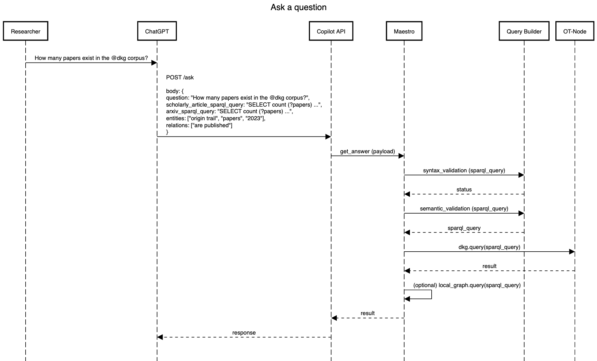
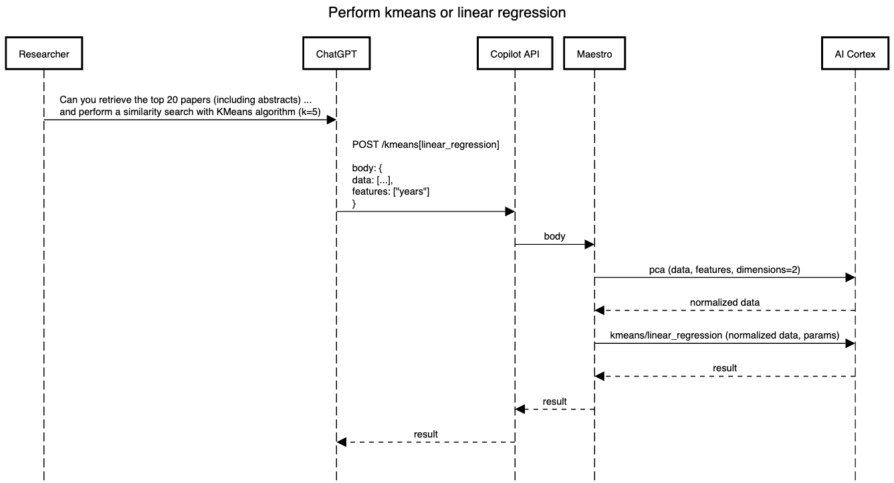

# Project specification

This project presents an AI-powered copilot for scientific research. This copilot improves the capabilities of LLMs by integrating a trust and verification layer through the OriginTrail Decentralized Knowledge Graph (DKG).

### User stories

The primary actors in this project are the user that uses the copilot, copilot as an LLM assistant, the copilot as a standalone application, and the DKG.

- As a user, I can ask the copilot to retrieve information about scientific papers from the DKG.
- As a user, I can ask the copilot to perform clustering or linear regression over retrieved data.
- As a user, I can manually verify the integrity proofs and ownership of retrieved information from the DKG using data retrieved from the DKG and blockchain transactions.
- As a user, I can provide feedback on the accuracy or relevance of the retrieved information about scientific papers, so the copilot can improve its recommendations over time.

### Functional requirements

#### Data Collection

- FR1.1: The research miner must be able to retrieve up to 50k scientific papers related to AI from the [Semantic Scholar](https://www.semanticscholar.org/product/api) and [ArXiv](https://info.arxiv.org/help/api/index.html) repositories.
- FR1.2: The research miner should be able to convert the retrieved scientific papers into knowledge assets, structuring them according to the [ScholarlyArticle](https://schema.org/ScholarlyArticle) and ArXiv ontologies.
- FR1.3: The research miner must have the capability to publish the created knowledge assets to the DKG.

#### Knowledge Retrieval and Inference

- FR2.1: The copilot should provide a set of techniques to build a SPARQL query based on natural language question and retrieve information from the DKG.
- FR2.2: The copilot should provide clustering and regression over retrieved data from the DKG.

### Technical requirements

#### Integration

TR1.1: The copilot must integrate seamlessly with an OpenAI LLM (e.g. ChatGPT or Microsoft Word).
TR1.2: The research miner should provide an API integration with the data repositories to retrieve datasets.
TR1.3: The copilot and research miner must contain integration with the DKG for publishing and retrieving knowledge assets.

#### Performance and Extensibility

TR2.1: The copilot should ensure efficient data retrieval and processing, especially when dealing with large SPARQL queries.
TR2.2: The copilot's architecture should be modular to allow for feature extensions.

### Architecture diagrams

The project consists of the research copilot and research miner.


In the copilot, the API module presents an interface for interactions with the LLM model. The Query Builder contains functionalities for constructing a SPARQL query. The AI Cortex module is used for inference over retrieved data. The Maestro orchestrator synchronizes all requests and implements the user feedback loop.

In the miner, the API crawler retrieves data from repositories. The Data Builder module transforms the retrieved data into assets using the ScholarlyArticle and ArXiv ontologies. The Data Publisher handles data import and interaction with the DKG using batching techniques for efficient data import.

### Sequence diagrams

The provided sequence diagrams illustrate the flow of operations for various functionalities.

#### Ask a question


<details>
title Ask a question

participant Researcher
participant ChatGPT
participant Copilot API
participant Maestro
participant Query Builder
participant OT-Node

Researcher->ChatGPT:How many papers exist in the @dkg corpus?


ChatGPT->Copilot API:POST /ask\n\nbody: {\nquestion: "How many papers exist in the @dkg corpus?",\nscholarly_article_sparql_query: "SELECT count (?papers) ...",\narxiv_sparql_query: "SELECT count (?papers) ...",\nentities: ["origin trail", "papers", "2023"],\nrelations: ["are published"]\n}

Copilot API->Maestro:get_answer (payload)
Maestro->Query Builder:syntax_validation (sparql_query)
Maestro<--Query Builder:status
Maestro->Query Builder:semantic_validation (sparql_query)
Maestro<--Query Builder:sparql_query
Maestro->OT-Node:dkg.query(sparql_query)
Maestro<--OT-Node:result
Maestro->Maestro:(optional) local_graph.query(sparql_query)
Maestro-->Copilot API:result
ChatGPT<--Copilot API:response
</details>

As a first step, a user asks a question to the copilot: "How many papers exist in the @dkg corpus?". The LLM creates a POST request with a payload that includes the original question, SPARQL queries for ScholarlyArticle and ArXiv ontologies generated by the LLM, and the extracted entities and relations from the question. The API layer then forwards this payload to the Maestro, which initiates the query generation process.

The Maestro first conducts a syntax validation of the SPARQL query. Subsequently, each predicate in the query is cross-checked using the ontology. If there's a semantic mismatch, word embeddings are utilized to determine the correct predicates from the ontology. The Maestro then attempts to fetch data from the DKG. If successful, the response is returned to the user. If the communication fails, a local RDF repository is used to retrieve requested data. Maestro can decide if such response should be sent to a user.

#### Perform inference


<details>
title Perform kmeans or linear regression

participant Researcher
participant ChatGPT
participant Copilot API
participant Maestro
participant AI Cortex

Researcher->ChatGPT:Can you retrieve the top 20 papers (including abstracts) ...\nand perform a similarity search with KMeans algorithm (k=5)

ChatGPT->Copilot API:POST /kmeans[linear_regression]\n\nbody: {\ndata: [...],\nfeatures: ["years"]\n}

Copilot API->Maestro:body
Maestro->AI Cortex:pca (data, features, dimensions=2)
Maestro<--AI Cortex:normalized data
Maestro->AI Cortex:kmeans/linear_regression (normalized data, params)
Maestro<--AI Cortex:result
Copilot API<--Maestro:result
ChatGPT<--Copilot API:result
</details>

User initiates the process by asking the copilot to perform either clustering or regression over retrieved data.

The model sends a POST request to the API with data and name of target features. Upon receiving the request, the API forwards the payload to Maestro. Then, Maestro invokes the AI Cortex to normalize and transform the data, and after that perform clustering or regression. Once the AI Cortex completes the operation, it sends the results back to Maestro, which is then returned to a user.

#### Data mining


<details>
title Data mining

participant API Crawler
participant Data Builder
participant Data Publisher
participant OT-Node
participant Data Repository

API Crawler->Data Repository:GET /papers?field&date_range&citations_limit
API Crawler<--Data Repository:json
API Crawler->Data Builder:create_assets (json, ontology)
API Crawler<--Data Builder:assets
API Crawler->Data Publisher:publish(assets)
Data Publisher->OT-Node:dkg.create(assets)
Data Builder<--Data Publisher:status
API Crawler<--Data Builder:status
</details>

The API Crawler sends a GET /papers request to the data repository API. When json results are retrieved, the API Crawler invokes create_assets(). The Data Builder creates assets based on a selected ontology and returns them to the API Crawler. Then, it invokes publish() and the Data Importer sends a /POST create request to the OT-Node. This flow is done in batches to balance the requests to the data repository and OT-Node.

#### Feedback loop

If users are not satisfied with the response, they can provide feedback. The LLM will try to update the request accordingly. There is a health page that displays the accuracy of the plugin, as well as a list of requests and responses, available at http://34.121.98.254:5000/d/a24b48d3-ee49-40d2-a62c-d247ca063b06.

Username / Password: dkgcopilot


### API reference

The API reference provides details on the endpoints available for the LLM model.

```json
{
  "openapi": "3.1.0",
  "info": {
    "title": "DKG Copilot for scientific research",
    "description": "AI-powered copilot designed to retrieve, analyze, and manage information about scientific papers utilizing OriginTrail Decentrailized Knowledge Graph (DKG).",
    "version": "v1.0.0"
  },
  "servers": [
    {
      "url": "https://copilot-beta.chatdkg.ai"
    }
  ],
  "paths": {
    "/ask": {
      "post": {
        "description": "Get assets from the DKG based on natural language question",
        "operationId": "askQuestion",
        "requestBody": {
          "content": {
            "application/json": {
              "schema": {
                "type": "object",
                "properties": {
                  "question": {
                    "type": "string",
                    "description": "Natural language question"
                  },
                  "entities": {
                    "type": "array",
                    "items": {
                      "type": "string"
                    },
                    "description": "Array of entities extracted from natural language question"
                  },
                  "relations": {
                    "type": "array",
                    "items": {
                      "type": "string"
                    },
                    "description": "Array of relations extracted from natural language question"
                  },
                  "scholarlyArticleSparqlQuery": {
                    "type": "string",
                    "description": "Generated SPARQL query based on initially provided ScholarlyArticle ontology and natural language question"
                  },
                  "arxivSparqlQuery": {
                    "type": "string",
                    "description": "Generated SPARQL query based on initially provided Arxiv ontology and natural language question"
                  }
                },
                "required": [
                  "question",
                  "entities",
                  "relations",
                  "scholarlyArticleSparqlQuery",
                  "arxivSparqlQuery"
                ]
              }
            }
          }
        },
        "responses": {
          "200": {
            "description": "OK",
            "content": {
              "application/json": {
                "schema": {
                  "$ref": "#/components/schemas/askQuestionResponse"
                }
              }
            }
          }
        }
      }
    },
    "/kmeans": {
      "post": {
        "description": "Endpoint for KMeans clustering",
        "operationId": "kmeans",
        "requestBody": {
          "required": true,
          "content": {
            "application/json": {
              "schema": {
                "type": "object",
                "properties": {
                  "X": {
                    "type": "array",
                    "items": {
                      "type": "string"
                    },
                    "description": "Array of strings (abstracts) for clustering"
                  },
                  "k": {
                    "type": "number",
                    "description": "Number of clusters. Default is 2."
                  }
                },
                "required": [
                  "X",
                  "k"
                ]
              }
            }
          }
        },
        "responses": {
          "200": {
            "description": "Number of data per clusters",
            "content": {
              "application/json": {
                "schema": {
                  "type": "object",
                  "properties": {
                    "clusters": {
                      "type": "array",
                      "items": {
                        "type": "integer"
                      }
                    }
                  }
                }
              }
            }
          }
        }
      }
    },
    "/linear_regression": {
      "post": {
        "description": "Endpoint for linear regression",
        "operationId": "linearRegression",
        "requestBody": {
          "required": true,
          "content": {
            "application/json": {
              "schema": {
                "type": "object",
                "properties": {
                  "X": {
                    "type": "array",
                    "items": {
                      "type": "number"
                    },
                    "description": "X for regression"
                  },
                  "y": {
                    "type": "array",
                    "items": {
                      "type": "number"
                    },
                    "description": "y for regression"
                  },
                  "predict_data": {
                    "type": "array",
                    "items": {
                      "type": "number"
                    },
                    "description": "predict_data for regression"
                  }
                },
                "required": [
                  "X",
                  "y",
                  "predict_data"
                ]
              }
            }
          }
        },
        "responses": {
          "200": {
            "description": "Predictions from regression",
            "content": {
              "application/json": {
                "schema": {
                  "type": "object",
                  "properties": {
                    "predictions": {
                      "type": "array",
                      "items": {
                        "type": "number"
                      }
                    }
                  }
                }
              }
            }
          }
        }
      }
    }
  },
  "components": {
    "schemas": {
      "askQuestionResponse": {
        "type": "object",
        "properties": {
          "response": {
            "type": "string",
            "description": "Array of assets from the DKG."
          }
        }
      }
    }
  }
}
```

### Data and Knowledge Assets

The selected ontologies for assets are `ScholarlyArticle` and `ArXiv`. Each research paper is represented as an asset in the DKG. About [50k knowledge assets](https://copilot-beta.chatdkg.ai/data) are published to the DKG. An example of knowledge asset using `ScholarlyArticle` ontology is presented below.
```
{
  "@context": "https://schema.org",
  "@id": "21dff47a4142445f83016da0819ffe6dd2947f66",
  "@type": "ScholarlyArticle",
  "isPartOf": "2633f5b2-c15c-49fe-80f5-07523e770c26",
  "name": "Peeking Inside the Black-Box: A Survey on Explainable Artificial Intelligence (XAI)",
  "author": [
      "Amina Adadi",
      "M. Berrada"
  ],
  "url": "https://www.semanticscholar.org/paper/21dff47a4142445f83016da0819ffe6dd2947f66",
  "abstract": "At the dawn of the fourth industrial revolution, we are witnessing a fast and widespread adoption of artificial intelligence (AI) in our daily life, which contributes to accelerating the shift towards a more algorithmic society. However, even with such unprecedented advancements, a key impediment to the use of AI-based systems is that they often lack transparency. Indeed, the black-box nature of these systems allows powerful predictions, but it cannot be directly explained. This issue has triggered a new debate on explainable AI (XAI). A research field holds substantial promise for improving trust and transparency of AI-based systems. It is recognized as the sine qua non for AI to continue making steady progress without disruption. This survey provides an entry point for interested researchers and practitioners to learn key aspects of the young and rapidly growing body of research related to XAI. Through the lens of the literature, we review the existing approaches regarding the topic, discuss trends surrounding its sphere, and present major research trajectories.",
  "year": 2018,
  "about": [
      "Computer Science"
  ],
  "citation": [
      "2649562ed8b1890be43e7875e9a55c21adb189f2",
      "6734e948a54b8b90683b50314d1233f70819243d",
      "5a678b41d493034c6ceb3d673b1210354111920c",
      "f1db4af25c3082f0bc6c5bec71cad790814b770b",
      "ac2c374219e2c75c40b3f8bd0b37224454b4bf8c",
      "7a93f0136f2ef9976904c99e915abf321ced241a",
      "f05a0fdfd41a6b438183d598b6cf753be3d394db",
      "c43ee9c879e92281d861d4232ced1d8dd519fa3f",
      "21dc2ffe9cb842ceda6498300341ba5ebbd1d3ef",
      "7a36e9ae002fb63882aee8562d78d9ba64e10b6d"
  ],
  "doi": "10.1109/ACCESS.2018.2870052"
}
```
### Hardware specification

 - OS: Ubuntu
 - RAM: 16GB
 - Disk: 1TB SSD

The research copilot and research miner are hosted on a server which communicates with the LLM, DKG, and data repositories. The project is implemented in Python due to large number of ML frameworks.

### Testing and verification

A predefined set of questions will be generated for testing the functionality of the plugin. There will be two types of questions: single-response and multiple-response questions. For single-response questions, accuracy will be used. For multiple-response questions, f1 score will be used. Each component of the Query Builder module will be tested separately.